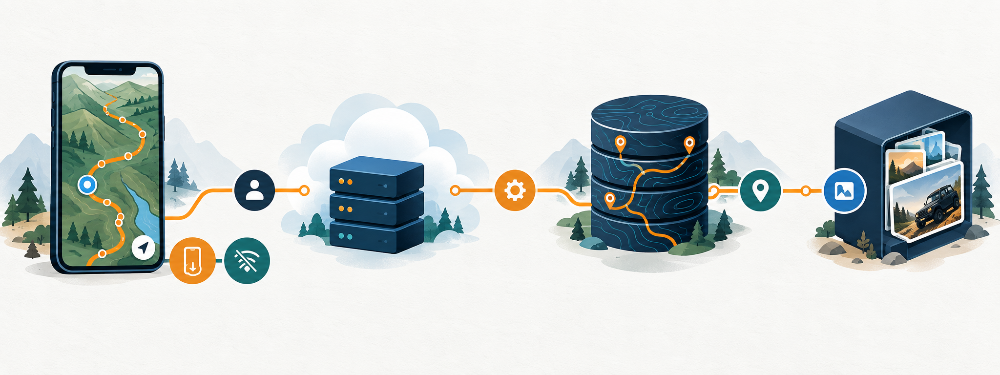

# Rastro


O Rastro é uma plataforma mobile aberta para quem explora trilhas de 4x4 e
quadriciclo. A ideia é transformar conhecimento espalhado em uma base viva de
roteiros: cada pessoa pode descobrir, planejar, registrar, avaliar, atualizar,
fazer fork e compartilhar uma trilha.

## O problema que o produto resolve

Quem organiza uma saída off-road normalmente precisa combinar mapa, grupos de
mensagem, relatos antigos e memória local para responder perguntas básicas:

- A trilha está aberta e qual é a condição atual?
- Quanto tempo o percurso realmente leva?
- Onde parar, encontrar água, abastecer ou tirar fotos?
- O roteiro serve para o meu veículo e para a experiência do grupo?
- Como registrar uma atividade sem perder o caminho quando não há sinal?

O Rastro reúne essas respostas em um único fluxo, com dados comunitários,
histórico de versões e rastreamento local-first.

## Design do produto

O produto foi pensado com quatro princípios:

1. **Confiança antes da aventura:** dificuldade, condições, avaliações,
   avisos e relatos aparecem antes do botão de iniciar.
2. **Planejamento concreto:** duração estimada, paradas, água, fotos,
   abastecimento e links para Waze, Google Maps e Apple Maps.
3. **Contribuição simples:** uma atividade registrada pode virar relato, ponto
   útil ou nova versão da trilha por fork.
4. **Offline por padrão:** o GPS continua gravando em SQLite; a sincronização
   com a nuvem pode acontecer depois.

Leia a [especificação do produto](docs/superpowers/specs/2026-10-03-offroad-trails-platform-design.md),
a [especificação AWS](docs/superpowers/specs/2026-10-03-rastro-aws-migration-design.md)
o [plano de migração](docs/superpowers/plans/2026-10-03-rastro-aws-migration.md),
a [especificação do design system](docs/superpowers/specs/2026-10-03-rastro-design-system-design.md)
e o [plano do design system](docs/superpowers/plans/2026-10-03-rastro-design-system.md).

Para onboarding e manutenção, consulte o [design system](docs/design-system.md),
a [arquitetura](docs/architecture.md), o [guia de onboarding](docs/onboarding.md)
e os [fluxos do produto](docs/flows/).

## Arquitetura



O mobile é construído com Expo/React Native e mantém o domínio independente da
infraestrutura. Quando as variáveis AWS estão configuradas, a composição usa:

- **Amazon Cognito** para login e identidade;
- **API Gateway HTTP + Lambda TypeScript** para API e autorização;
- **Aurora PostgreSQL Serverless v2 + PostGIS** para trilhas, geometrias,
  pontos e atividades;
- **S3 privado + URLs pré-assinadas** para fotos;
- **CloudFront** para distribuição de mídia publicada;
- **CDK TypeScript** para ambientes `dev`, `staging` e `prod`;
- **SQLite** para atividades e GPS offline.

Sem configuração AWS, o app usa o catálogo demo/local para desenvolvimento de
interface. Nenhuma chave secreta AWS é incluída no bundle mobile.

## Rodar localmente

```bash
npm install
npm test -- --runInBand
npm run lint
npx tsc --noEmit
npm start
```

Para habilitar AWS, copie `.env.example` para `.env` e preencha os valores
públicos emitidos pelo CDK:

```dotenv
EXPO_PUBLIC_AWS_REGION=us-east-1
EXPO_PUBLIC_AWS_API_URL=https://...
EXPO_PUBLIC_COGNITO_USER_POOL_ID=us-east-1_...
EXPO_PUBLIC_COGNITO_USER_POOL_CLIENT_ID=...
```

## Infraestrutura AWS

Pré-requisitos: uma conta AWS, AWS CLI autenticada, Node.js e CDK Bootstrap
no ambiente escolhido. A stack cria Aurora e outros recursos com custo real;
comece em `dev` e revise o template antes do deploy.

```bash
npm --prefix backend run build
npx cdk synth -c environmentName=dev
npx cdk bootstrap
npx cdk deploy -c environmentName=dev
```

O schema e o seed inicial ficam em:

- `infra/db/001_rastro_schema.sql`
- `infra/db/seed.sql`

O deploy gera os identificadores do Cognito, URL da API e domínio CloudFront.
Copie esses valores para `.env` antes de iniciar o app.

## Fluxo atual

- explorar roteiros públicos e filtrar por veículo;
- consultar mapa, duração, dificuldade e pontos de interesse;
- planejar uma saída com paradas;
- iniciar uma atividade com GPS em segundo plano;
- salvar localmente e sincronizar atividades idempotentes;
- publicar relato ou criar uma nova versão por fork;
- denunciar conteúdo desatualizado ou perigoso;
- navegar via Waze, Google Maps ou Apple Maps.

O rastreamento em segundo plano exige um development build nativo; o Expo Go
não representa esse comportamento completamente.

## Organização do código

- `src/domain`: regras e tipos sem dependências de infraestrutura;
- `src/application`: casos de uso, autenticação e sincronização;
- `src/data/local`: SQLite e armazenamento offline;
- `src/data/remote/aws`: Cognito, API client e gateways AWS;
- `backend`: handlers Lambda e acesso à RDS Data API/S3;
- `infra`: stack CDK, schema PostGIS e seed;
- `app` e `src/features`: rotas e telas mobile.

## Documentação para devs

- [Design system Rastro Terra](docs/design-system.md)
- [Arquitetura](docs/architecture.md)
- [Onboarding](docs/onboarding.md)
- [Fluxo de descoberta e planejamento](docs/flows/explore-trail.md)
- [Fluxo de registro e contribuição](docs/flows/record-and-contribute.md)
- [Decisões arquiteturais](docs/decisions/)
- [Diagramas Mermaid](docs/diagrams/)

As ilustrações desta documentação são conceituais e servem para comunicar o
produto e a arquitetura; não representam uma tela final nem um template exato
do console AWS.
