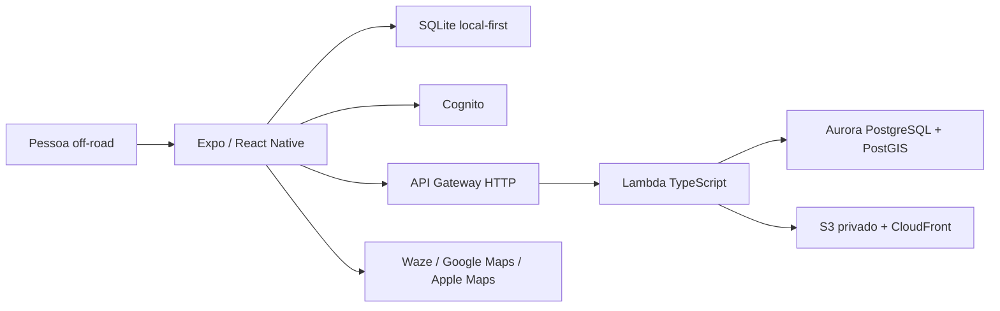

# Arquitetura do Rastro

## Visão geral

O Rastro é um app mobile Expo/React Native para descobrir, planejar, registrar
e compartilhar trilhas off-road. A arquitetura separa domínio, casos de uso,
dados locais/remotos e telas para que o app continue útil sem sinal e possa
trocar o backend sem contaminar as regras de produto.



## Camadas do repositório

```text
app/                         rotas Expo Router e composição de tela
src/design/                  tokens e componentes visuais sem negócio
src/features/                UI orientada a fluxo
src/application/             casos de uso e portas
src/domain/                  entidades e regras puras
src/data/local/              SQLite e repositórios offline
src/data/remote/aws/         Cognito, API client e gateways AWS
backend/src/handlers/        entradas Lambda por recurso
backend/src/shared/          HTTP, auth, RDS Data API e mídia
infra/                       CDK, schema PostGIS e seed
docs/                        decisões, fluxos, diagramas e onboarding
```

## Contratos importantes

- `TrailRepository` lista e carrega versões de trilha.
- `PointRepository` carrega pontos úteis associados à trilha.
- `ActivityRepository` salva atividades localmente.
- `ActivityGateway` sincroniza uma atividade e, quando suportado, publica um
  relato remoto.
- `AuthGateway` isola login, restauração de sessão e logout.
- `Rastro` design components recebem somente props visuais, dados simples e
  callbacks.

## Composição mobile

`src/application/mvp/mobile-services.ts` é o ponto de composição. Com variáveis
AWS públicas completas, ele conecta Cognito, API e gateways AWS. Sem essas
variáveis, o app usa dados demo/local para desenvolvimento visual. Em ambos os
modos, a gravação da atividade continua local.

Nenhum segredo AWS é colocado no bundle. O mobile recebe apenas região, URL da
API e IDs públicos do User Pool/client.

## Autenticação e autorização

1. O app autentica no Cognito usando o app client público.
2. A sessão é mantida pelo adaptador Cognito e pelo SecureStore.
3. O API Gateway valida o JWT nas rotas privadas.
4. Lambda deriva `authorId` do `sub` do token; nunca confia no autor enviado no
   body.
5. Aurora mantém `author_id` e histórico de versões.

## Dados e offline

Atividades e amostras GPS são primeiro salvas no SQLite. Uma fila de pendências
envia o mesmo identificador de atividade para a API; o upsert idempotente evita
duplicação. Falhas de rede não removem o registro local.

## API AWS

| Recurso | Público | Privado |
| --- | --- | --- |
| `GET /v1/trails` | sim | — |
| `GET /v1/trails/{id}` | sim | — |
| `PUT /v1/trails` | — | Cognito |
| `GET /v1/private/trails/{id}` | — | Cognito |
| `GET /v1/trails/{trailId}/points` | sim | — |
| `PUT /v1/points` | — | Cognito |
| `POST /v1/activities/sync` | — | Cognito |
| `POST /v1/reports` | — | Cognito |
| `POST /v1/media/presign` | — | Cognito |

## Infraestrutura

CDK cria Cognito, VPC isolada, Aurora Serverless v2, S3 privado, CloudFront,
API Gateway, Lambdas, Secrets Manager e permissões mínimas necessárias. O
schema PostGIS e o seed ficam em `infra/db/` e precisam ser executados como
etapa operacional após o banco estar disponível.

## Limites atuais

- Membership de grupos e permissões colaborativas completas ainda estão fora
  do MVP.
- Refresh/expiração de token precisa de smoke test em dispositivo físico.
- Migração histórica de Supabase ainda não foi automatizada.
- Waze, Google Maps e Apple Maps são integrações externas por deep link, não
  provedores substituídos pelo Rastro.
