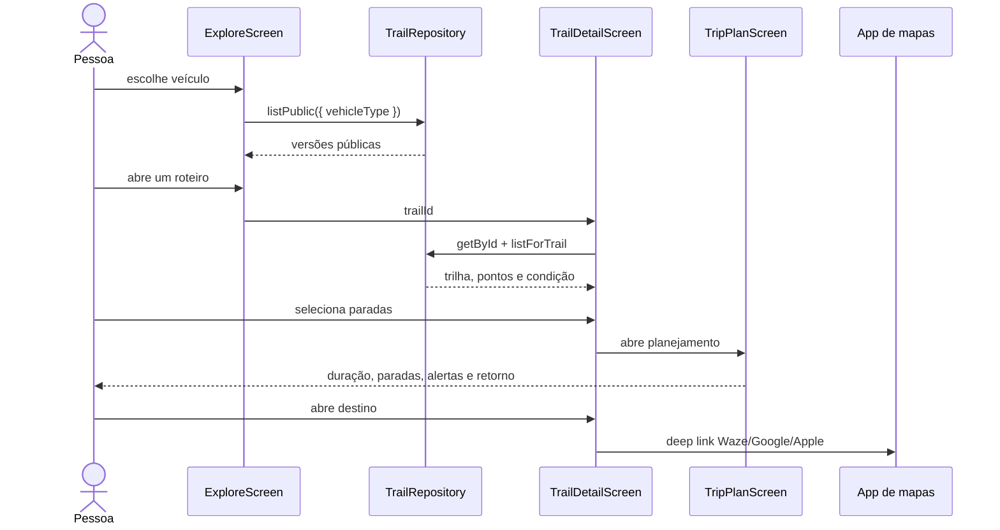

# Fluxo: descobrir e planejar uma trilha

## Regras do fluxo

- A listagem pública nunca inclui conteúdo privado.
- Dificuldade, duração e condição aparecem antes da navegação externa.
- Pontos como água, foto, combustível e obstáculo são contexto operacional.
- O plano calcula parada e retorno sem alterar a geometria da trilha.
- Links externos são uma escolha do usuário e não substituem o mapa interno.
