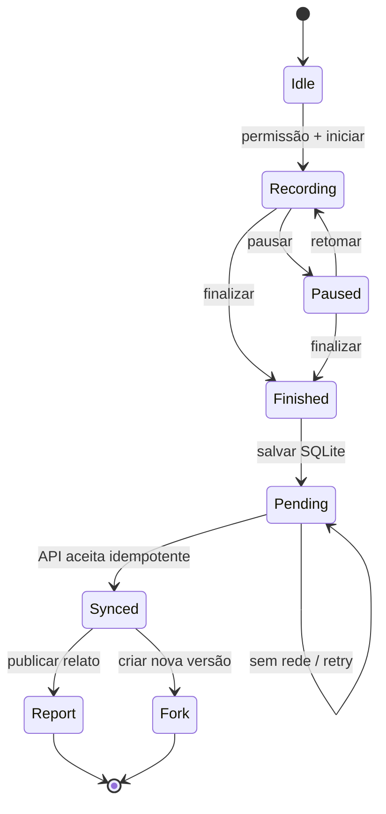

# Fluxo: registrar e contribuir sem sinal

## Garantias

1. A amostra GPS é persistida antes de depender da rede.
2. O identificador da atividade é reutilizado no retry.
3. A API deriva o autor do JWT Cognito.
4. Relato remoto só é confirmado depois que a atividade está sincronizada.
5. Fork cria nova versão vinculada a `parentVersionId`; não sobrescreve a
   trilha original.
